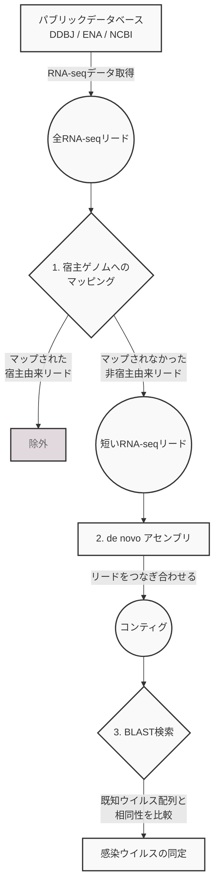

```mermaid
graph TD
    A[パブリックデータベース<br>DDBJ / ENA / NCBI] -->|RNA-seqデータ取得| B((全RNA-seqリード))
    
    B --> C{1. 宿主ゲノムへの<br>マッピング}
    
    C -->|マップされた<br>宿主由来リード| D[除外]
    C -->|マップされなかった<br>非宿主由来リード| E((短いRNA-seqリード))
    
    E --> F[2. de novo アセンブリ]
    F -->|リードをつなぎ合わせる| G((コンティグ))
    
    G --> H{3. BLAST検索}
    H -->|既知ウイルス配列と<br>相同性を比較| I[感染ウイルスの同定]
    
    classDef default fill:#f9f9f9,stroke:#333,stroke-width:2px;
    classDef exclude fill:#e2d9df,stroke:#333,stroke-width:2px,color:#666;
    class D exclude;
```
